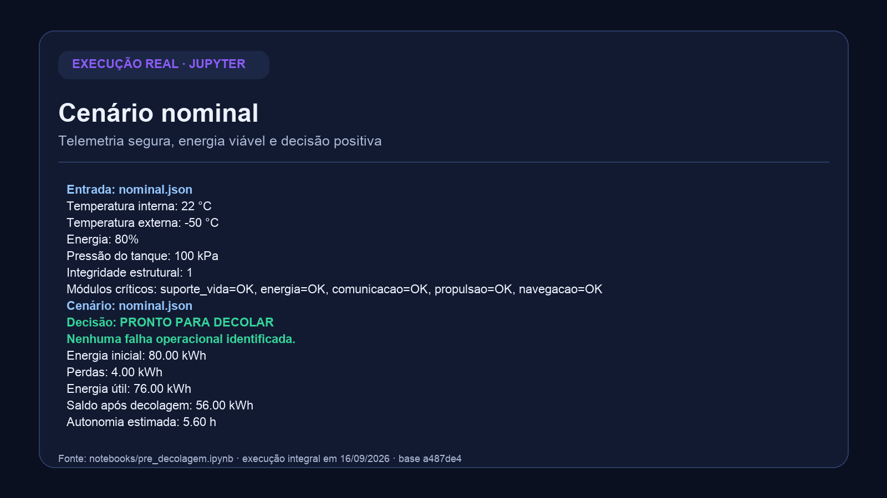
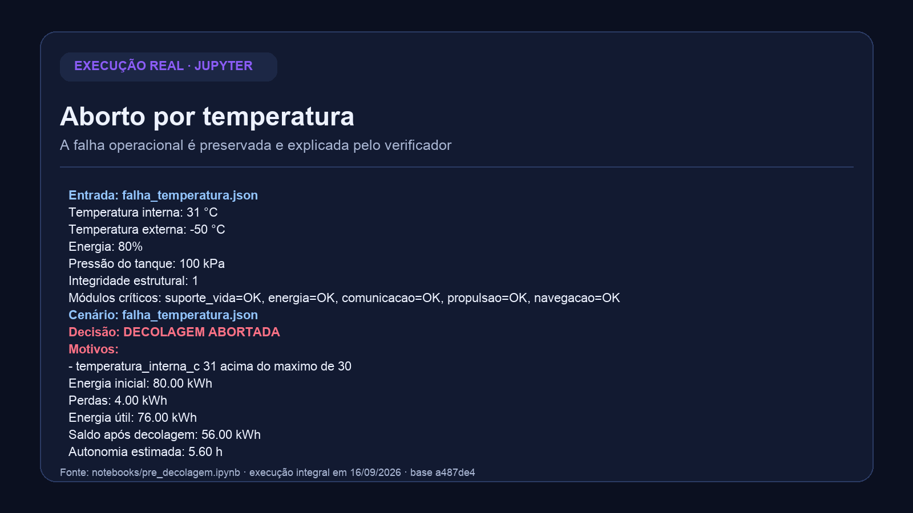
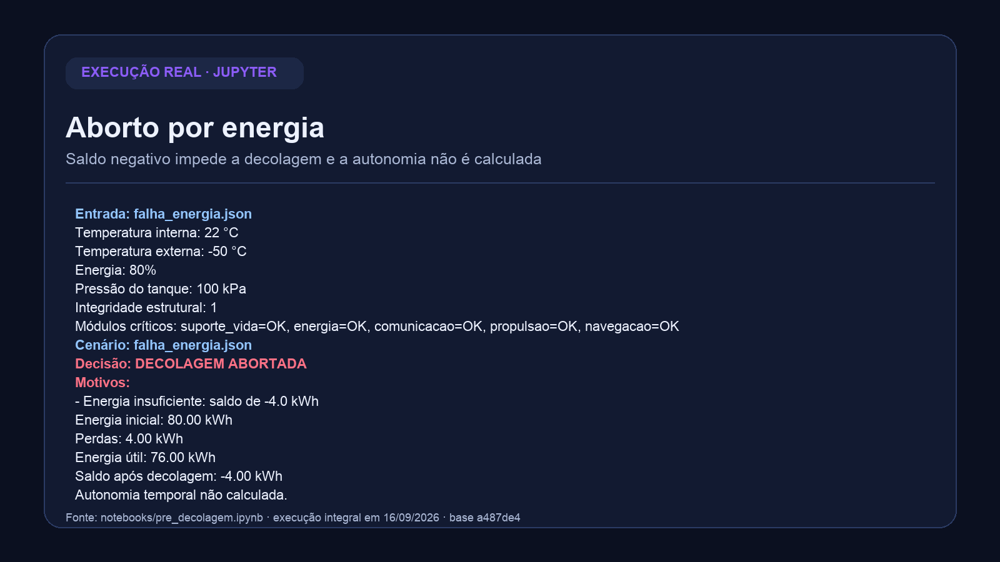

# Relatório operacional de pré-decolagem — Fase 1

Projeto acadêmico da FIAP que organiza telemetria sintética, valida os dados,
calcula o balanço energético e decide entre `PRONTO PARA DECOLAR` e
`DECOLAGEM ABORTADA`. A decisão é determinística, explicável e sempre
apresenta os motivos de uma falha.

> **Escopo:** simulação didática. Os dados e limites não são parâmetros
> certificados de uma nave real, e a IA não autoriza operações.

## Entrega final

- [Relatório completo em PDF](relatorio/relatorio-pre-decolagem.pdf)
- [Versão textual editável do relatório](relatorio/relatorio-pre-decolagem.md)
- [Fonte executável do PDF](scripts/gerar_relatorio.py)
- [Notebook executado](notebooks/pre_decolagem.ipynb)
- [Checklist de entrega](docs/entrega.md)
- [Revisão técnica](docs/revisao-final.md)

O repositório público é:
[github.com/bkampdev/FIAP-PBL-FASE-1](https://github.com/bkampdev/FIAP-PBL-FASE-1).

## Evidências da execução

As imagens abaixo foram geradas a partir dos outputs persistidos do notebook
executado, sem alteração dos valores. O procedimento e a versão de origem
estão documentados em [`evidencias/README.md`](evidencias/README.md).

### Cenário nominal



### Aborto por temperatura



### Aborto por energia



## Como executar

Requer Python 3.10 ou superior. O núcleo funciona localmente, sem API key e
sem internet depois da instalação das dependências.

```sh
git clone https://github.com/bkampdev/FIAP-PBL-FASE-1.git
cd FIAP-PBL-FASE-1
python3 -m venv .venv
source .venv/bin/activate
python -m pip install -r requirements.txt
python -m unittest discover -s tests -v
python -m jupyter notebook notebooks/pre_decolagem.ipynb
```

No Jupyter, reinicie o kernel e execute todas as células em ordem. Para uma
execução não interativa e reproduzível:

```sh
python -m jupyter nbconvert --to notebook --execute --inplace notebooks/pre_decolagem.ipynb
```

## Fluxo da solução

1. `src.validacao.carregar_json` lê o cenário e trata arquivo ausente ou JSON
   malformado.
2. `src.validacao.validar_telemetria` separa erro de formato de falha
   operacional.
3. `src.energia.calcular_energia` calcula energia inicial, perdas, energia útil,
   saldo e autonomia.
4. `src.verificacao.verificar_pre_decolagem` avalia todas as regras e acumula
   os motivos de aborto.
5. `src.missao.executar_cenario` integra o fluxo e produz um resultado único.
6. `src.apresentacao.formatar_resultado` transforma o resultado em texto sem
   recalcular decisão ou energia.

O notebook demonstra quatro casos: nominal, temperatura insegura, energia
insuficiente e entrada inválida. Os JSONs ficam em `dados/`.

## Limites didáticos

| Campo | Faixa segura inclusiva |
| --- | --- |
| Temperatura interna | 15 a 30 °C |
| Temperatura externa | -150 a 120 °C |
| Energia | 50 a 100% |
| Pressão do tanque | 90 a 110 kPa |
| Integridade estrutural | 1 |
| Módulos críticos | todos em `OK` |

A viabilidade energética exige saldo estritamente positivo após perdas e
consumo da decolagem. O contrato completo está em
[`docs/telemetria.md`](docs/telemetria.md).

## Estrutura do repositório

```text
dados/       cenários JSON reproduzíveis
docs/        telemetria, algoritmo, energia, IA, reflexão e revisão
evidencias/  imagens geradas a partir da execução do notebook
notebooks/   notebook principal da atividade
relatorio/   PDF final e versão textual editável
scripts/     fontes executáveis dos artefatos finais
src/         módulos Python da solução
tests/       suíte automatizada
```

## Correspondência com o enunciado do FIAP ON

| Requisito | Evidência principal |
| --- | --- |
| 1.1 Telemetria | `docs/telemetria.md`, `dados/*.json`, notebook |
| 1.2 Algoritmo | `docs/algoritmo.md`, `src/pseudocodigo_verificacao.md` |
| 1.3 Script Python | `src/`, notebook e 48 testes automatizados |
| 1.4 Análise energética | `src/energia.py`, `docs/energia.md`, notebook |
| 1.5 Análise assistida por IA | `docs/analise-ia.md` |
| 1.6 Reflexão crítica | `docs/reflexao_critica.md` |
| PDF completo | `relatorio/relatorio-pre-decolagem.pdf` |
| Prints e execução | `evidencias/` e esta página |

## Equipe — Grupo 16

| Integrante | RM | Contribuição principal |
| --- | --- | --- |
| Davi Coninck Cassaro | RM572772 | telemetria, validação e testes |
| Guilherme Cardoso Bremenkamp | RM574229 | integração dos cenários e notebook |
| Lorenzo Mendes Rocha | RM575361 | verificação, geração sintética e reflexão |
| Gabriel Gonzales | RM574746 | análise por IA, apresentação e revisão |
| Eduardo Backes Klauck | RM575889 | energia, documentação e relatório |

Os cinco integrantes aparecem no Grupo 16 da atividade no FIAP ON, conferido
em 16/09/2026. A atividade só é considerada entregue depois da confirmação do
envio no portal; arquivos no GitHub não substituem essa etapa.

## Observações sobre IA

A análise assistida por IA classifica os cenários, identifica anomalias e
sugere riscos, sempre revisados contra os dados e o código. O módulo
`src/geracao.py` usa `GaussianMixture` como extensão opcional para gerar dados
sintéticos, mas não participa da decisão autoritativa nem é necessário para
executar o notebook principal.

## Licença

Consulte [`LICENSE`](LICENSE).
